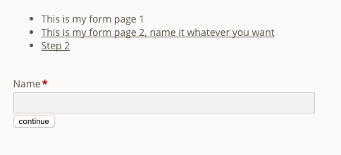

# mp_forms

This is a Contao extension that allows you to create real forms over multiple pages.

After installing the module, you have a new setting in the form definitions where you can define the GET parameter
you want the extension to work with. By default, this is `step` so it will generate `step=1`, `step=2` etc. in the URL.
If, for whatever reason `step` is already in use on your webpage, you can change the settings there.

Moreover, you'll get a new form field called `Page break`. Every time you use this form field, the module will insert a
page break in the form.

`mp_forms` validates if a user manually wants to go to step 3 and did not fill in step 1 or 2. I this case the user will be redirected
to step 1 (obviously, only if you had required fields on step 1).

In case you don't want your users to be redirected but prefer to have some Ajax magic, you may combine this extension
with our [ajaxform](https://github.com/terminal42/contao-ajaxform) one. They work perfectly well together!

:warning: **You may not use the regular submit form field element**:
> Note that you must not be using a regular submit form field but use the `Page break` again. Otherwise, you
> won't have any `back` button displayed. `mp_forms` will automatically detect the last `Page break` as behaving like the form submit.
> If you use the regular submit form field anywhere in your form, `mp_forms` is completely disabled and you won't have
> any steps!

## The `Summary` element

A typical use case of forms that are split into multiple steps is to summarize data that was previously entered.
This might be on the final step before the data is submitted but it can also happen in between.
You can use this special form field type to display the data.
Accessing the data can be done via the "Simple Token" technology that is typical for Contao.
All the form fields of previous steps are passed on using the `##form_*##` notation.
You may also access the labels using `##formlabel_*##`.

Files are handled a bit differently because there is more than just one value to a file.
You may use `extension`, `size`, `mime` as well as a `download_url` which is generated for you.
To make things simple, the default token for the file (e.g. if the form field was named `upload` that would be `##file_upload##`)
contains the HTML rendered using the `ce_download` template.

A simple summary for all the submitted fields, encapsulated in simple `<div>` elements can be displayed using
the `##mp_forms_summary##` token.

Because trying things out yourself is usually easier and so you don't have to remember all the tokens that can be
used, you may simply place the `##mp_forms_debug##` token  which will show you all the available tokens with their
content.

## Frontend module to display a step navigation

This module ships with a front end module that allows you to easily build a front end navigation for
each of your steps.
Not styled at all, it might look something like this in the end:



Note that by default steps will just be named `Step x` in every language. The `Page break` form field
label field will be used for the navigation if you provide it.
    
## Insert tags

There are insert tags you can use to fetch information about the state of the form:

| Insert tag                                           | Description                                      | Example  |
|------------------------------------------------------|--------------------------------------------------|----------|
| `{{mp_forms::<form id>::step::current}}`             | Contains the current step you are on             | 2        |
| `{{mp_forms::<form id>::step::total}}`               | Contains the total steps of your form            | 5        |
| `{{mp_forms::<form id>::step::percentage}}`          | Contains the percentage of your progress         | 20       |
| `{{mp_forms::<form id>::step::numbers}}`             | Contains a classic `x of y` display              | `2 / 5`  |
| `{{mp_forms::<form id>::step::label}}`               | Contains the label of the current step           | `Step 1` |
| `{{mp_forms::<form id>::field_value::<field_name>}}` | Contains the submitted value of a previous field |          |

Note that they can be especially useful together with a `Custom HTML` front end module.
Let's assume you want to display a progress bar for form ID `5`:

````html
<div class="progress">
    <div class="progress-bar">
        <div class="progress-bar-inner" style="width:{{mp_forms::5::step::percentage}}%"></div>
    </div>
    <div class="numbers">{{mp_forms::5::step::numbers}}</div>
</div>
```
